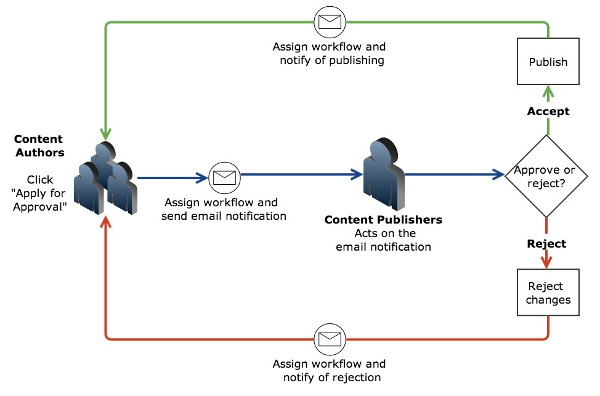
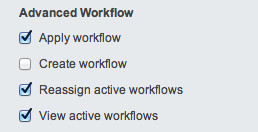
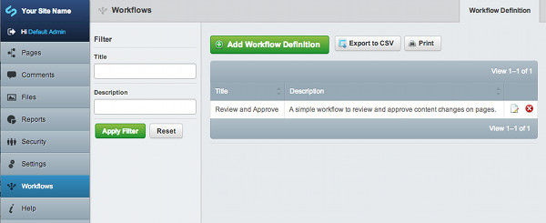
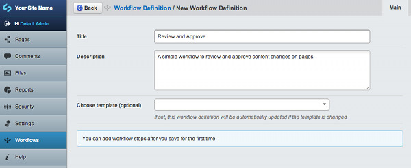
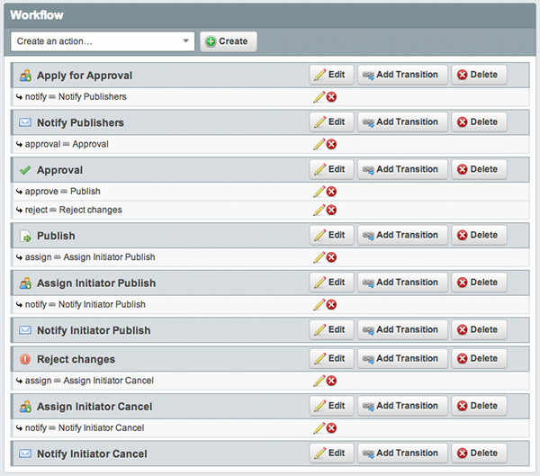
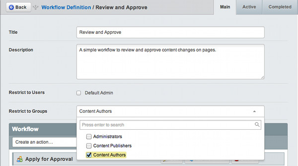
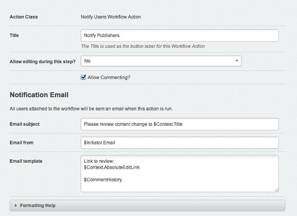
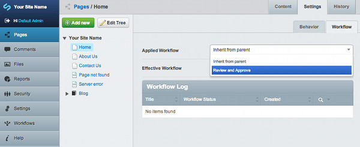

<!--
title: Setting up AdvancedWorkflow
pagenumber: 3
-->

# Setting up advanced workflow

## In this section:
- Understand workflow
- Set up Workflow Groups (Security Admin)
- Set up a simple Review and Approve workflow

## What is a Workflow?
In its most basic sense, a workflow means that new content or changes to existing content, need to go through an approval process before they're able to be published to the live website.

This works by limiting access to certain parts of the workflow process to certain users or groups of users set up in the SilverStripe CMS Security admin.

The CMS can have an unlimited number of workflows created and running within it, but only one workflow can be attached to a page at any one time.

## Workflow Terminology
- **Workflow Definition**: Description of all the "actions" and "transitions" that make up a single workflow process to publish a page. Definitions are applied to pages within the CMS and are managed through the "Workflows" section of the CMS.
- **Workflow Instance**: When a user wants to publish a page, instead of selecting the 'publish' button, they instead start a workflow, or more specifically, an instance of the "Workflow Definition" applied to that page. This "Instance" contains all the relevant data (e.g. user choices, comments, etc) for the running workflow on that pages content.
- **Workflow Action**: A workflow can have many actions. Actions describe a single process occurring at each workflow step. Each piece of workflow logic is encapsulated in an action, such as assigning users, publishing a page, or sending notifications.
- **Workflow Transition**: A transition is a 'pathway' between two actions, and defines how a workflow should proceed from one action to another. You can chain transitions, or have the user choose between different ones (e.g. "approve" vs. "reject")

Each Workflow Definition comprises a number of definable ‘Actions’ such as "Publish" and "Reject" and each action may have any number of "Transitions" leading out from it that connect one action to another.

Users and groups can have individual permissions assigned to them on Workflow Transitions, which gives workflow administrators fine-grained control over the content-actions allowed to be performed. Each transition the current CMS user has permission to enact, will be available to them as a button on each item of content assigned to them.

## Setting up a simple CMS workflow in SilverStripe 3
Since the actual workflows can vary greatly for any website, there's no default workflow. 

You will need to configure the workflow in the ‘workflows’ admin interface. Here, we'll create a simple ‘Review and Approve’ workflow with the following features:
1. Content Authors make a change and request approval from Content Publishers.
1. An email is sent to the Content Publishers for Approval.
1. Content Publishers can view and then reject or approve the change.
1. An email is then sent to Content Authors to notify the rejection or the content is to be published.

### **Step 1. Set up user groups**
CMS Administrators must first set up user groups who will be configured in the Workflow, _see_ [http://userhelp.silverstripe.org/framework/en/for-website-administrators/changing-and-managing-users](http://userhelp.silverstripe.org/framework/en/for-website-administrators/changing-and-managing-users) _for setting up users and groups in the Secuirty admin_. 

For this example workflow we have the following user groups set up: 
1. Content Authors
-- The users creating and maintaining content on the website, these users will change content and apply for approval
1. Content Publishers
-- The users who will review and approve any content changes on the website before they are published to live

Ensure these user groups have the following permissions checked:

Once your user groups are set you can now apply Workflow actions to these user groups. 

Note: Any user with ‘full administrative rights’ set will see all Workflow action buttons in the CMS, plus they will have the ability to Publish and Draft content regardless if a workflow is configured_ _on a page.

### **Step 2. Create a Workflow Definition**
Now you have your workflow users created you can now create a workflow. Since the actual workflows can vary greatly from site to site, there's no default workflow in SilverStripe 3.

SilverStripe 3 workflow provides a simple review and approve template which can be selected when creating a Workflow Definition. You will however need to complete filling out settings in order to use the workflow template.

1. To create a Workflow Definition select the _Workflows_ admin in the Left Hand Menu to show the Workflow administration

2. Click on ‘Add Workflow Definition’ to bring up the Workflow form

Enter:
**Title**
The title for your workflow
**Description**
A summary of the workflow
**Reminder Email**
Duration in # of Days where an automated email is forwarded to a defined user group when a workflow action is required
**Choose from Template (optional)**
SilverStripe 3 Workflow allows SilverStripe developers to create templates for workflows, this is where these templates can be selected. 

3. Click ‘Save’ 

Note: You must save your definition before you can add workflow actions

### **Step 3. Adding Workflow Actions**
Once you have saved your Workflow Definition you can now add Workflow Actions. 

Workflow Actions are ‘triggers’ for the next process in a workflow such as notifications or publishing content. 

The following example will configure a simple Review and Approve workflow. First create all your actions to match your desired workflow process and then create the transitions from each action.

From the ‘Create an action” drop down select the following actions:

1. **Assign Users To Workflow Action**: Title this “Apply for Approval”.
This creates a Workflow Button on a page, which then assigns the workflow process to configured users.
1. **Notify Users Workflow Action**: Title this “Notify Publishers”.This action configures the notification emails when an action is triggered. 
1. **Simple Approval Workflow Action**: Title this “Approval”.Provides the decision point and two buttons to Publish or Reject the current content change.
1. **Publish Item Workflow Action:** Title this “Publish”.Button to send an email to Publish content.
1. **Assign Users To Workflow Action**: Title this “Assign Initiator Publish”.This action assigns who receives email notification to Publish content i.e. Content Authors.
1. **Notify Users Workflow Action:** Title this “Notify Initiator Publish”.Email the above “initiator” to Publish the content they have changed.
1. **Cancel Workflow Action**: Tile this “Reject Changes”.Button to Reject changes and send an email.
1. **Assign Users To Workflow Action**: Title this “Assign Initiator Cancel”Assigns the user to Reject the changes i.e. Content Authors.
1. **Notify Users Workflow Action**: Title this “Notify Initiator Cancel”.Email the above “initiator” to not publish what is changed. 

Next, add your transitions as in the below example, by clicking on “Add Transition” on each action, setting a title and a "next Action":

As you can see in the above workflow the “Approval” action is the decision point which transitions to either Publish or Reject actions depending on which of these actions is selected.

Once either action button is pressed in the SilverStripe CMS on a page it will assign the workflow back to the original initiator and also trigger a notification email configured in the “Notify Initiator Cancel” or “Notify Initiator Publish”.

### **Step 4. Assigning Users to the Workflow**
When you have all the Workflow Actions and Transitions created you must assign the workflow to users in two areas.

The first is the workflow process itself, that is, which users will be restricted to the workflow. 

This is set on the Workflow Definition ‘Restrict to Users’ or ‘Restrict to Groups’ fields. In this case we wish to restrict the workflow to be applied when a Content Author wishes to make content changes. Select "Content Authors" from the drop down.

Next, you must assign the correct users to each action. For example when a Content Author triggers the workflow it is the Content Publishers who receive and must action the next step in the workflow process. 

First select the “Edit” button on the "Apply for approval" action.

For this workflow action select the Content Publishers Security group. These users will now receive the email notifications of content changes in the workflow once the “Apply for Approval” button is clicked by Content Authors.

Next, select the "Notify Publishers" action and fill out the "Notification Email", you can use several placeholders to create your email template, set the from email address and subject. See the "Formatting Help" drop down for help.

Repeat these steps for the other assign and notify actions (this time setting the user too the "Initiator").

You can further restrict certain actions and transitions to specific users if desired using the “User” check boxes and the “restricted users” tabs on transition forms.

### **Step 5. Assign Workflows to a Page**

Now that you have a Workflow, it must be assigned to a page. 

1. Select the page you wish a workflow to be required
2. Select the ‘Settings’ tab 
3. Select the ‘Workflow’ tab
4. Select the desired workflow from the ‘Applied Workflow’ drop down

