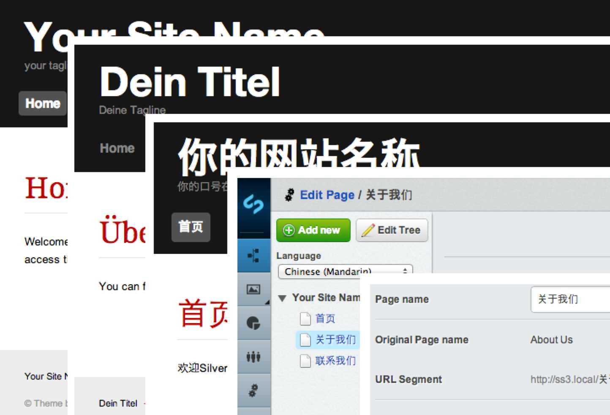
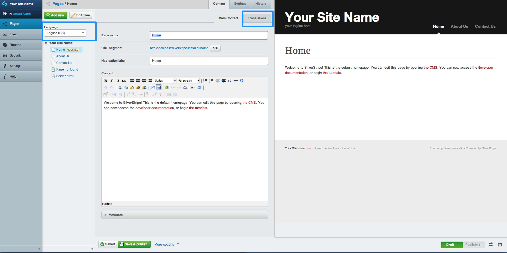

<!--
pagenumber: 8
title: Working with translation
-->

# Working with translation

## In this section:

* Understand translatable content
* Learn how to translate content
* Translating your site title and settings

## Before we begin:

* Make sure you have the SilverStripe Translatable module installed.
* Make sure your website theme, CSS and HTML has been updated to support Translatable navigation so users can select the desired language
* Make sure you are in the "Pages" section on the Navigation Tabs 
* Make sure you have full administrative rights to Translate to all available languages
 
## Understanding translatable content

The SilverStripe Translatable module allows you to create and edit multiple pages in various languages. This module also adds the ability for your users to select which language of a page they wish to view.

Notes:

The SilverStripe Translatable module does not translate content automatically, content authors will need to enter the translated content manually for each translated page.

To begin translating content select a page in your site tree from the "Pages" admin. You can see in the below image:

* The language drop down above your site tree - This allows you to select which translated pages to edit
* The 'Translations' tab - This allows you to create a translated version of the selected page

## Translating content

To translate a selected page, click on the 'Translations' tab. 

Then select the desired language you want to translate the content into from the 'Language' drop down field.

Then click 'Create'.

You will then be presented with a new site tree in the "Pages" admin containing a duplicated page for the language you selected:

You can now edit this page's content with the desired translated content. You can enter translated content directly into each field of the page, for example you can enter translated content into the Page Name, Navigation Label and content fields.

Just like publishing your standard content, click 'Save & Publish' and you now have a translated version of the original page you selected.

## Translating your site title and settings

To translate your site title and settings, select 'Settings' from the left menu, then click the 'Translations' tab, then select the language from the list of existing languages you wish to edit.

You can then add your translated content into each field:

